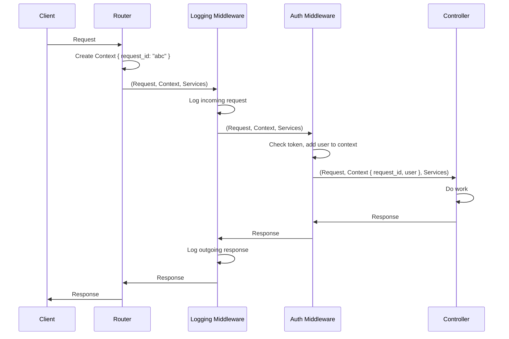

# Dream

**Clean, composable web development for Gleam. No magic. No surprises.**

Dream is a web toolkit that gets out of your way. Everything is explicit. Your `main()` function shows exactly what's happening—no framework deciding things for you behind the scenes.

## Why Dream?

Because you've debugged enough "helpful" frameworks at 2am.

Here's a complete web application:

```gleam
import dream/servers/mist/server.{bind, listen, router, services} as dream
import router.{create_router}
import services.{initialize_services}

pub fn main() {
  dream.new()
  |> services(initialize_services())
  |> router(create_router())
  |> bind("localhost")
  |> listen(3000)
}
```

That's it. No hidden configuration. No magic middleware appearing from nowhere. Everything you need to understand your app is right there in `main()`.

## Why Not a Framework?

How many times have you learned how to do authentication? Routing? Database queries? Validation?

Not the concepts—the **framework's way** of doing them. The Rails Way. The Django Way. The Spring Way. Knowledge that evaporates the moment you switch languages or projects.

**Frameworks teach you framework-specific solutions:**
- How to use their ORM query builder (useless in the next framework)
- How to configure their router (different syntax every time)
- How their middleware system works (learn it again next framework)
- How their dependency injection works (completely different next language)
- How to structure files their way (throw it out when you leave)

**Dream provides patterns without enforcement:**
- Suggested structure, or organize however you want
- Components are just functions—use them together or separately
- Battle-tested patterns for common problems, or use your own patterns
- Everything is functions and data you control

Controllers are functions. Models are functions. Views are functions. You already know how functions work.

The knowledge you build using Dream—explicit dependencies, pure functions, separation of concerns—transfers to any language, any project, any team. Because it's fundamental software engineering, not framework minutiae.

No framework lock-in. No knowledge that expires when you switch stacks.

## How It Flows

When a request arrives:

```
1. Request arrives
2. Context created (AppContext with unique request_id)
3. Router matches path/method → finds controller
4. Middleware runs (if any) → can enrich context
5. Controller executes with (Request, Context, Services)
6. Returns Response
```

Example with auth and logging (your middleware, not Dream's):



Simple pipeline. No magic.

## The Pieces

At its core, Dream is a router. Around it are helpers for common needs.

---

### Router *(the core)*  

Pattern matches requests to controllers:
```gleam
Router(routes: List(Route(context, services)))

Route(
  method: Method,           // Get, Post, etc.
  path: String,            // "/users/:id"
  controller: fn(Request, context, services) -> Response,
  middleware: List(Middleware),
)
```
Supports path parameters (`:id`), wildcards (`*`, `**`), and middleware chains.

---

### Controllers

In Dream, controllers are nothing more than simple functions:
```gleam
fn(Request, context, services) -> Response
```
No base class. No decorators. Extract params, do work, return response.

---

### Middleware

Middleware are functions you can chain to run before and after your controller:
```gleam
fn(Request, context, services, next: fn(...) -> Response) -> Response
```
Example: route with `middleware: [auth, logging]` flows as: 
```
auth (in) → logging (in) → controller → logging (out) → auth (out)
```
Modify request/context going in, response coming out.

---

### Context & Services

**Context** is per-request data—anything that changes per-request:
- User info after authentication
- Request tracking ID
- Session data

**Services** are shared dependencies—same for all requests:
- Database connections
- HTTP clients  
- Caches

Dream starts with `AppContext` (just a `request_id` field) and `EmptyServices` (no dependencies). Define your own types when you need them.

---

### HTTP Client

Gleam doesn't have a streaming HTTPS client. That's a problem when you need to stream AI inference responses or download large files.

We could've built one from scratch. Bad idea—HTTPS clients are security-critical and complex. Instead, we wrapped Erlang's battle-hardened `httpc` with a clean Gleam interface:

```gleam
client.new
  |> client.method(http.Get)
  |> client.scheme(http.Https)
  |> client.host("api.example.com")
  |> client.path("/stream")
```

Streaming and non-streaming modes. Builder pattern. Runs on the BEAM. Leverages 20+ years of Erlang HTTP client hardening.

---

### Models & Views *(optional patterns)*

Models and views are just ways to organize your functions. Not required—Dream won't stop you from doing things differently.

But here's the thing: figuring out where code goes, how to separate concerns, and whether your pattern will scale is exhausting. Especially in a new language. These patterns work. We use them in production. They scale.

**Controller** calls model and view:
```gleam
pub fn show(request: Request, _context: Context, services: Services) -> Response {
  let assert Ok(param) = get_param(request, "id")
  let assert Ok(id) = param.as_int
  
  case product_model.get(services.db, id) {
    Ok(product) -> product_view.respond(product, param)
    Error(_) -> not_found_response()
  }
}
```

Clean. Dream's router guarantees path parameters exist for matched routes—if they don't, that's a bug worth panicking over. Use `assert` for impossible errors. Use `case` for real errors (database failures, not found).

**Model** handles data:
```gleam
// product_model.gleam
pub fn get(db, id: Int) -> Result(Product, Error)
pub fn list(db) -> Result(List(Product), Error)
pub fn decoder() -> Decoder(ProductData)
```

**View** handles presentation:
```gleam
// product_view.gleam
pub fn respond(product: Product, param: PathParam) -> Response {
  case param.format {
    Some("json") -> json_response(status.ok, to_json(product))
    Some("csv") -> text_response(status.ok, to_csv(product))
    _ -> html_response(status.ok, to_html(product))
  }
}

pub fn to_json(product: Product) -> String
pub fn to_html(product: Product) -> String
pub fn to_csv(product: Product) -> String
```

Controller orchestrates. Model fetches data. View formats it. All just functions. No classes. No inheritance. No framework enforcement.

---

Use what you need. Skip what you don't.
 
 ## Core Patterns
 
 Beyond the basics, Dream provides patterns for scaling your application logic.
 
 ### Operations *(Business Logic)*
 
 Controllers should be thin. When logic gets complex (validation, multiple database calls, external services), use an **Operation**.
 
 ```gleam
 // operations/create_user.gleam
 pub fn execute(services: Services, params: Params) -> Result(User, Error) {
   use _ <- result.try(validate(params))
   use user <- result.try(user_model.create(services.db, params))
   let _ = mailer.send_welcome(services.mailer, user)
   Ok(user)
 }
 ```
 
 **Why?** Operations are testable without HTTP. They can be reused by API endpoints, background jobs, and CLI tasks.
 
 ### Multi-Format Responses *(JSON + HTML)*
 
 Serve API clients and browsers from the same controller.
 
 ```gleam
 pub fn show(request: Request, context: Context, services: Services) -> Response {
   // ... fetch data ...
   case format {
     "json" -> json_response(ok, view.to_json(data))
     "html" -> html_response(ok, view.to_html(data))
     "htmx" -> html_response(ok, view.card(data)) // Partial for dynamic updates
   }
 }
 ```
 
 **Why?** Don't build two separate backends. One app, multiple views.
 
 ## What a Real App Looks Like

Here's a complete Dream app with models, views, and controllers:

```
your_app/
├── src/
│   ├── main.gleam
│   ├── router.gleam
│   ├── services.gleam
│   ├── context.gleam
│   ├── config.gleam
│   │
│   ├── controllers/
│   │   ├── users_controller.gleam
│   │   └── tasks_controller.gleam
│   │
│   ├── middleware/
│   │   └── logging_middleware.gleam
│   │
│   ├── models/
│   │   ├── user/
│   │   │   ├── user_model.gleam
│   │   │   └── sql.gleam
│   │   └── task/
│   │       ├── task_model.gleam
│   │       └── sql.gleam
│   │
│   ├── views/
│   │   ├── user_view.gleam
│   │   └── task_view.gleam
│   │
│   ├── operations/
│   │   └── reorder_tasks.gleam
│   │
│   ├── templates/
│   │   ├── components/
│   │   ├── elements/
│   │   ├── layouts/
│   │   └── pages/
│   │
│   ├── services/
│   │   └── database.gleam
│   │
│   └── types/
│       └── user.gleam
│
└── gleam.toml
```

Everything has its place. Nothing is hidden. Scale from "Hello World" to production without restructuring.

## Yeah, But Gleam? Really?

Fair question. Gleam is young. The ecosystem is small. Why choose it for web development?

**Because Gleam runs on the BEAM. And the BEAM was literally built to solve web app problems.**

### What The Heck is a BEAM?

BEAM (Bogdan/Björn's Erlang Abstract Machine) is the virtual machine that runs Erlang, Elixir, and Gleam code. Like the JVM for Java or V8 for JavaScript, but designed for completely different goals.

The JVM was built for portability. V8 was built for speed. 

**The BEAM was built for reliability and concurrency.**

Ericsson created Erlang and the BEAM in the 1980s for telecom switches. The requirements:
- Handle millions of concurrent phone calls
- Never go down (99.9999999% uptime—"nine nines")
- Recover from failures without restarting
- Hot-swap code without dropping connections

Turns out, those are the exact problems web applications have.

### What You Get on the BEAM

**Concurrency** - Millions of lightweight processes per server. Each HTTP request gets its own isolated process. No thread pools, no async/await gymnastics, no event loop bottlenecks. Just spawn a process. The BEAM's preemptive scheduler handles the rest.

**Fault tolerance** - Processes crash in isolation. One request throws an error, the rest keep running. No cascading failures. No servers going down because one database query hung.

**Scalability** - Start with one server. Add more when traffic grows. The BEAM distributes processes across machines transparently. No architectural rewrite from monolith to microservices required to scale.

**Real-world results:**
- **WhatsApp**: 2.8 million concurrent connections per server on Erlang [1]
- **Discord**: 12M+ concurrent users, 26M WebSocket events/sec on Elixir with ~5 engineers maintaining 20+ services [2]
- **Bleacher Report**: Reduced from ~150 servers to ~8, 10× faster updates, 200M push notifications/day [3]
- **Pinterest**: 14,000 notifications/sec, reduced from 30 to 15 servers for their notification service [4]
- **BBC**: Elixir serving almost all BBC web and app traffic [5]
- **Remote**: Grew from zero to unicorn (~$3B valuation) in ~2 years with Elixir as the primary backend [6]

### And Gleam?

Gleam gives you the BEAM's superpowers with modern developer experience:

- **Type safety** - Catch bugs at compile time, not in production
- **Modern syntax** - No learning Erlang's Prolog-style syntax
- **Functional programming** - Immutable by default, easier to reason about
- **Erlang/Elixir interop** - Use 30+ years of battle-tested BEAM libraries

The BEAM handles concurrency, fault tolerance, and scaling. Gleam gives you type safety and readability. You write functions.

It's a pretty good division of labor.

### "But You Can't Hire for Gleam"

True. The Gleam job market is tiny. So is Elixir's compared to Python or JavaScript.

But here's what you can hire for:
- **Strong engineers** who can learn (Gleam's syntax takes a day)
- **Functional programming experience** (Gleam is simpler than Scala, Haskell, or even Elixir)
- **BEAM experience** (Elixir and Erlang developers are productive in Gleam immediately)
- **Type system familiarity** (TypeScript, Rust, Go developers get it)

**And here's the thing about good engineers:** They don't want to work on boring problems with mundane tools. They definitely don't want to work with something shoehorned into being a solution it's not great at (looking at you, Node.js for CPU-intensive work).

Good engineers want to learn new things. They want to work on interesting tech. They just don't want to spend a year learning the borrow checker before they can be productive (sorry, Rust).

Gleam hits the sweet spot:
- Interesting (functional, type-safe, runs on the BEAM)
- New (fresh approach, modern syntax)
- Not overwhelming (learn the basics in a weekend, productive in a week)

Discord runs 20+ Elixir services with 5 engineers serving 12M+ concurrent users [2]. Remote reached unicorn status in ~2 years with Elixir [6]. Strand ships production Gleam with zero Gleam-related crashes and a small team [7].

Your choice: hire 20 engineers to manage microservices hell in the "safe" language, or hire 5 who actually want to use the BEAM and solve problems instead of fighting infrastructure.

## Quick Start

Ready to build your first Dream app? Check out the [5-Minute Quickstart](docs/quickstart.md).

Want to see what Dream adds over raw Mist? See the [Dream vs Mist comparison](docs/reference/dream-vs-mist.md).

Want to dive into working examples? See `examples/` for complete applications you can run.

## Documentation

**Learning Path:**
- 📘 [5-Minute Quickstart](docs/quickstart.md) - Your first Dream app
- 📗 [Learning Path](docs/learn/) - 2 hours from hello world to production patterns

**Guides:**
- [Authentication](docs/guides/authentication.md) - JWT, Sessions, Context
- [Controllers & Models](docs/guides/controllers-and-models.md) - MVC Patterns
- [Multiple Formats](docs/guides/multiple-formats.md) - JSON, HTML, HTMX
- [Operations](docs/guides/operations.md) - Complex Business Logic
- [Testing](docs/guides/testing.md) - Unit and Integration Testing
- [Deployment](docs/guides/deployment.md) - Running in production

**Reference:**
- [API Documentation](https://hexdocs.pm/dream) - Complete API reference on HexDocs
- [Dream vs Mist](docs/reference/dream-vs-mist.md) - What Dream provides
- [Architecture](docs/reference/architecture.md) - How it all fits together
- [Design Principles](docs/reference/design-principles.md) - The "why" behind decisions

**Examples:**
- [Working Applications](examples/) - Complete runnable projects

## Philosophy

Dream is **explicitly not a framework**. We provide:

✅ Clean interfaces and types  
✅ Common patterns (controllers, models, middleware)  
✅ Useful utilities (validation, response builders)  
✅ Working examples

You provide:

🎯 Your application structure  
🎯 Your router configuration  
🎯 Your controllers and models  
🎯 Your business logic

**No magic. No hidden behavior. Everything explicit.**

Because finding where that database connection came from shouldn't require a treasure map.

## Contributing

See [CONTRIBUTING.md](CONTRIBUTING.md) for guidelines.

## License

[MIT License](LICENSE.md)

---

### References

[1]: https://www.erlang-factory.com/upload/presentations/558/efsf2012-whatsapp-scaling.pdf "WhatsApp Scaling - Erlang Factory"
[2]: https://elixir-lang.org/blog/2020/10/08/real-time-communication-at-scale-with-elixir-at-discord/ "Real time communication at scale with Elixir at Discord"
[3]: https://www.erlang-solutions.com/case-studies/bleacher-report-case-study/ "Bleacher Report Case Study - Erlang Solutions"
[4]: https://venturebeat.com/dev/pinterest-elixir/ "Pinterest's Elixir adoption - VentureBeat"
[5]: https://www.elixirconf.eu/talks/how-elixir-powers-the-bbc-from-poc-to-production-at-scale/ "How Elixir powers the BBC - ElixirConf EU"
[6]: https://elixir-lang.org/blog/2025/01/21/remote-elixir-case/ "Remote: growing from zero to unicorn with Elixir"
[7]: https://gleam.run/case-studies/strand "Optimising for maintainability - Gleam in production at Strand"

---

*Built with Gleam. Runs on the BEAM. Works like you'd expect.*
