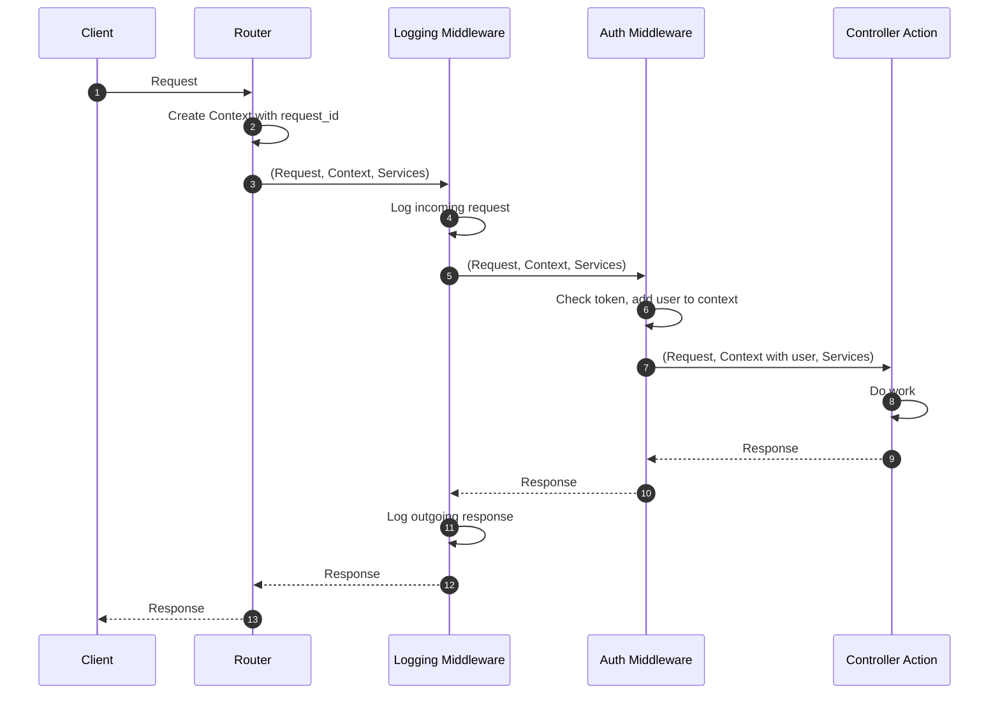

# How Dream Works

**Understanding the request flow from arrival to response.**

When a request arrives at your Dream server, here's exactly what happens:

## The Flow

```
1. Request arrives
2. Context created (AppContext with unique request_id)
3. Router matches path/method → finds controller action
4. Middleware runs (if any) → can enrich context
5. Controller action executes with (Request, Context, Services)
6. Returns Response
```

## Visual Flow

Example with auth and logging middleware:



Simple pipeline. No magic.

## Step-by-Step Breakdown

### 1. Request Arrives

The HTTP server (Mist) receives the request and passes it to Dream's router.

### 2. Context Created

Dream creates a default `AppContext` with a unique `request_id`. This context travels through the entire request lifecycle.

### 3. Router Matches

The router looks at the HTTP method (GET, POST, etc.) and path (`/users/123`) to find a matching route. Path parameters like `:id` are extracted automatically.

### 4. Middleware Runs

If the route has middleware, each middleware function runs in order:
- Can modify the request
- Can enrich the context (e.g., add authenticated user)
- Can call `next()` to continue, or return early to short-circuit

### 5. Controller Action Executes

The controller action receives:
- **Request**: HTTP method, path, headers, body
- **Context**: Per-request data (request ID, authenticated user, etc.)
- **Services**: Shared dependencies (database, cache, HTTP clients)

The controller action orchestrates:
- Calls models to fetch data
- Calls operations for complex business logic
- Calls views to format responses
- Maps domain errors to HTTP status codes

### 6. Response Returns

The response flows back through middleware (which can modify it), then back to the client.

## Key Points

- **Everything is explicit** - You can trace the entire flow by reading code
- **Type-safe** - The compiler verifies routes match controller actions
- **Composable** - Middleware chains are just functions calling functions
- **No hidden state** - Context and Services are passed explicitly

## Next Steps

- [Components](components.md) - Detailed explanation of routers, controllers, middleware
- [Request Flow Example](../examples/simple/) - See it in action
- [Architecture Reference](../reference/architecture.md) - Deep technical dive

